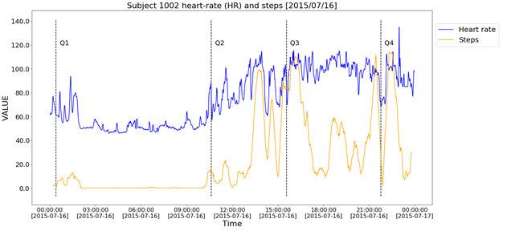
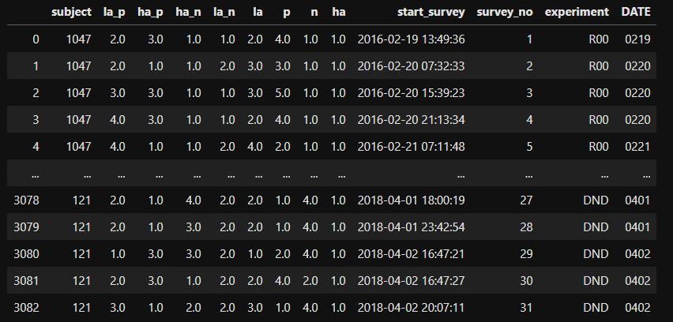

# Predicting emotional valence using wearable fitness tracker and psychometrics tests

For a brief explanation of our project you can watch this [video](https://youtu.be/58fUX8AiiNI). 
This project is explained in more detail in our [white paper](https://gitlab.oit.duke.edu/duke-mids/2019-2020/emotional-states/-/blob/master/Documents/Presentations/MIDS-Capstone-Whitepaper.pdf). 
You could have access to the slides used in the video [here](https://gitlab.oit.duke.edu/duke-mids/2019-2020/emotional-states/-/blob/master/Documents/Presentations/Capstone_Final_Presentation.pdf).

### Background: 
This project was our Final Capstone Project for the MS in Interdisciplinary Data Science at Duke University. 

### Problem:  
The aim of our project is two-fold: first, we examine if we can recognize emotional valence using data derived from commercially available wearable fitness trackers and second, we seek to see if the inclusion of additional indicators including psychometric tests and demographic data improves the performance of our model.
We aimed to predict emotional states in both new users and current users.
We aimed to predict or solve two different questiosn states for these cases. 
First, can we know if a subject is experiencing a positive or negative emotional state? 
Second, can we predict if the subject is going to be happier or unhappier than his or her baseline levels?

### Folder Structure:
* **Code** --- All our code files live here
    * **EDA** --- Files used for data cleaning and EDA, with self-explanatory names
    * **Old_models** --- Deprecated
    * **Final_Model** --- Scripts used to train, test and select the best model and a notebook plotting the most important feature for each model. The data used for this project is provided.
* **Papers** --- Related reserach materials
* **Documents** 
    * **Addendum**
    * **Data_dictionary** 
    * **Survey_references_and_manuals** 
    * **Presentations** --- Slides and White Paper.
    * **Technical_document** 

### Data:
**How many data sources are there?** 
The data is composed by two datasets from different experiments (DNN and R00), both recollected by researchers 
from the Motivated Cognition and Aging Brain Lab (Mikella's Laboratory). 
There are 226 different subjects in total (122 subjects in one (DNN) and 104 (R00)) 

Every dataset is a collection of four different types of data:
- Experiencing sample data 
- Survey data 
- Fitbit data (Steps, HR and sleep)
- Neuroimage data (not available yet)

**Surveys** 

---
R00 and DND have 10 instruments (or surveys) in common that we are going to use for this project
- SBQ (Social Behavior Questionary)
- SWLS (Satisfaction With Life Scale)
- TPQ-NS (Trait Dimension Personality Questionary - Novelty Seeking)
- FTP (Future time perspective)
- NEO-C (Five Factor Inventory - Conscientiousness)
- NEO-E (Five Factor Inventory - Extraversion)
- NEO-N (Five Factor Inventory - Neuroticism)
- AVI (Affect Valuation Index)
- BIS (Impulsiveness)
- BISBAS (Activation/Inhibition) 
References for every instrument could be consulted on the [Reference section](https://gitlab.oit.duke.edu/duke-mids/2019-2020/emotional-states/tree/master/Documents/Survey_references_and_manuals)

Also both experiments share basic demographic data in common like:
- Age
- Sex
- Race and Ethnicity
- Weight and Height
- Education 
- Income

A more detailed description of the data could be consulted on the [Data dictionary](https://gitlab.oit.duke.edu/duke-mids/2019-2020/emotional-states/tree/master/Documents/Data_dictionary)

**Experiencing sample**

---
Both experiments followed every subject for a period of 10 days.
The subjects completed a survey 3 times a day , at random times (between walking up time and sleeping time), about 
how were they feeling at that moment. 

*The figure shows a register of a single day of one of the subjects. The dashed line (Qn) shows when the subject completed an ‘experiencing sample survey’.
Steps (orange line) are  measured on steps per minute, Heart rate (blue line) is measured on heart rate per minute.*

Subjects's emotion were punctuated in different sub-scales:
- Low arousal positive (low_arousal_pos)	
- High arousal positive (high_arousal_pos)
- High arousal negative (high_arousal_neg)
- Low arousal negative (low_aroudal_neg
- Low arousal (low_arousal)
- Positive (pos)
- Negative (neg)
- High Arousal (high_arousal)
 
 

*Example of subjects' answers to the Experiencing Sample survey*
 
**Fitbit**

---
All the subjects used a Fitbit device in order to measure phisiologycal, motor, and behavioral metrics.
The data could be divided in three big categories:

Acvity metrics

- Date
- Calories Burned
- Steps
- Distance
- Floors
- Minutes Sedentary
- Minutes Lightly Active
- Minutes Fairly Active
- Minutes Very Active	
- Activity Calories

Sleeping metrics
- Date
- Minutes Asleep
- Minutes Awake
- Number of Awakenings
- Time in Bed

Heart Rate metrics
- Hear Rate (HR) (sampling rate varied)

**What types of assumptions were made in the collecting of the data?** 
- Subjects have been selected randomly and did not present medical conditions prior to the beginning of the experiment.- 
- We used every subject's answer to the experiencing sample survey as an observation. We assumed that the observations are independent.

**What keys exist within the data to aid in joins?** 

In both datasets,  and for all the data types, `SubjectID` is the primary key.
The format of the key changes depending on the experiment and on the data type (i.e. `R00-Survey`
represents `SubjectID` with the column name *Subject* and only with 4 digits, whilst `R00-Experience sampling` name *id* to the 
`SubjectID` columns and represent the data with 4 digits a slash and the number of the survey)
The datasets had different shapes and schemas. We joined all the data in a single dataset after we end delimited what data we were going to be useful for our model.

### Modeling
A better description of the modeling process could be consulted in our [white paper](https://gitlab.oit.duke.edu/duke-mids/2019-2020/emotional-states/-/blob/master/Documents/Presentations/MIDS-Capstone-Whitepaper.pdf).

For this project with trained several models. We tested the recall, precision and f1 score of the different models and we ended up selection the models with the best performance for the following objectives:

Inferring x for **current users** with **only Fitbit data**, where x could be positive/negative emotion or normalized valence binary label.  
Inferring x for **new users** with only **Fitbit data**, where x could be positive/negative emotion or normalized valence binary label. 
Inferring x for **current users** using **all data**, where x could be positive/negative emotion or normalized valence binary label. 
Inferring x for **new users** using **all data**, where x could be positive/negative emotion or normalized valence binary label. 

A technical document explaining how to run the scripts could be consulted [here](https://gitlab.oit.duke.edu/duke-mids/2019-2020/emotional-states/-/blob/master/Documents/Technical_document/Technical_Document.pdf). 

### Conclusions

**1. In general, the data (wearable data, psychological data, health metrics and demographic data) would help the prediction of emotional states for both current users and new users.**

As mentioned above, for positive/negative emotion prediction, the use of additional data helps improve the F1 scores by 0.119 and 0.104 for current users and new users respectively. For relative valence prediction, the use of additional data helps improve the F1 scores by 0.109 and 0.086 for current users and new users respectively. 

**2. Psychological features and age have a significant correlation on absolute level of valence. While wearable data reflects relative valence, especially heart rate related features.**

Psychological features are one time measurements, they are highly correlated with the base level of emotional states for each subject. Therefore, when predicting the absolute level of valence, the positive/negative emotion, their influence is significant. In contrast, the relative valence is generated by comparing valence score with its mean within each subject. In this case, the influence of one time measurements are being cancelled out by the subtraction. Instead, Fitbit data stands out as it capture the regulatory activity and the change of activity, which are correlated to the fluctuation of emotional states.

**3. It is hard to predict emotional states for a new user. The pattern we have learnt from current users could actually harm the prediction for new users.**

In both cases, prediction for positive/negative emotion and prediction for relative valence, the precision of prediction for new users are worse than random guesses. This means the knowledge we extracted from current users could not be applied to new users. An possible explanation for this observation is that emotional characteristics differ by person, and it is hard to find common patterns with respect to emotional states. This explanation could also be backed up by figure 5, in which we have shown the widespread histogram of the mean and standard deviation of positive score and negative score, indicating the variability of emotional traits by person.

### Deliverables

*   Documentation of data cleaning steps and modeling details [x]

*   Model that successfully predicts emotional states from Fitbit data [x]
 
*  Characterization of when the model performs successfully or unsuccessfully [x]
 
*  Slide presentation describing the project to a non-technical audience [x]

